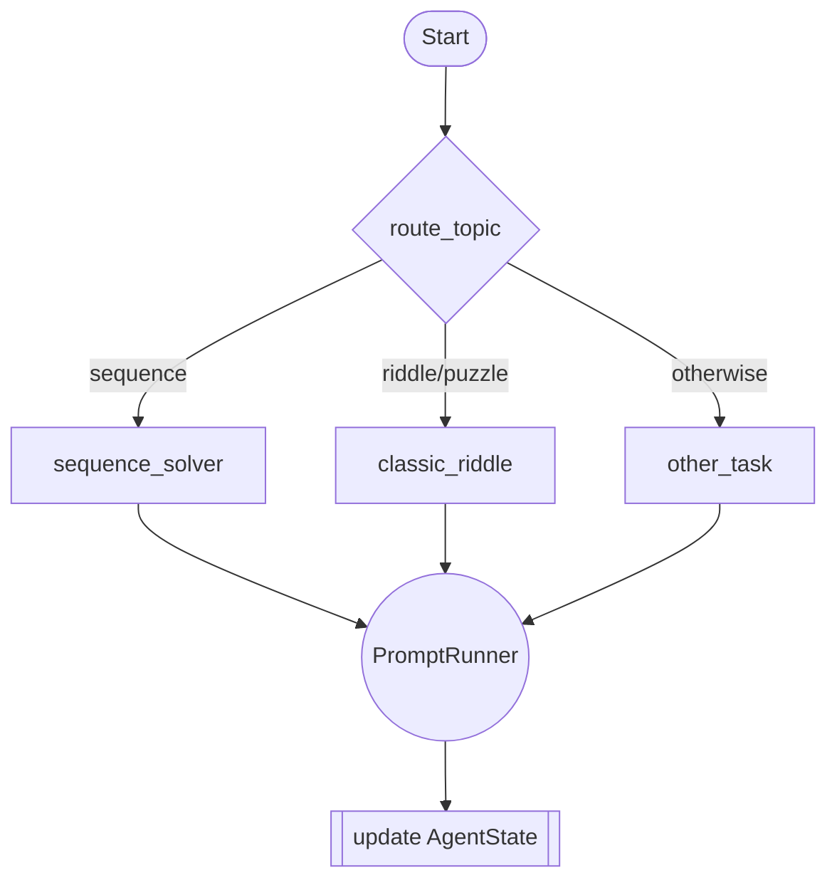

# Reasoning Pipeline (final)

## Overview
This package implements a compact reasoning pipeline that routes multiple-choice questions to purpose-built solvers. Each solver crafts a targeted prompt, delegates execution to a shared `PromptRunner`, and receives a normalised triple of `(predicted option, reasoning, confidence)`. The code is intentionally small so it can be audited quickly for hackathon submissions or GitHub demos.

## Diagram


## Approach
1. **State abstraction** (`state.py`): defines `AgentState` and a `make_agent_state` helper that extracts options from CSV rows.
2. **Prompt execution** (`prompt.py`): `PromptRunner` invokes an Ollama-hosted model, slices out a JSON-like `[option, reasoning, confidence]` list, clamps values, and injects them back into the state.
3. **Task-specific nodes** (`nodes.py`): three concise solvers produce targeted prompts for sequences, riddles, and general reasoning questions.
4. **Graph orchestration** (`graph.py`): builds a LangGraph `StateGraph`, wires each node, and routes based on the problem topic.
5. **Command-line entry point** (`main.py`): loads the dataset, invokes the compiled graph row-by-row, and saves predictions with reasoning paragraphs and confidence scores.

## Model
- **Default**: `qwen3:4b` served via [Ollama](https://ollama.com/).
- **Interface**: `PromptRunner` accepts any Ollama model name (`--model` flag). The prompt nudges the model to respond with `[option, reasoning, confidence]` so parsing stays simple.
- **Key expectations**:
  - Responses should include a JSON-compatible list.
  - Reasoning can be lines or a paragraph; it is normalised to a bullet list by the runner.

## Running the Pipeline
### Prerequisites
- Python 3.10+
- Ollama running locally with the desired model pulled (e.g. `ollama pull qwen3:4b`)
- Install Python dependencies:
  ```bash
  pip install langchain-ollama langgraph pandas
  ```

### Execute
```bash
python -m final.main --input train.csv --output predictions.csv --model qwen3:4b
```
Arguments:
- `--input` (required): CSV file containing `problem_statement`, `topic`, and `answer_option_1` … `answer_option_4`.
- `--output` (optional): where to store the predictions CSV.
- `--model` (optional): Ollama model name (defaults to `qwen3:4b`).

### Output Columns
- `predicted_option`: integer 1–5 (5 indicates "none of the above").
- `predicted_solution`: concatenated reasoning steps returned by the solver.
- `confidence`: float between 0 and 1 extracted from the model reply.

## Repository Layout
```
final/
├── __init__.py          # Marks the package (intentionally blank).
├── graph.py             # Builds and compiles the LangGraph.
├── main.py              # CLI entry point.
├── nodes.py             # Task-specific solvers.
├── prompt.py            # PromptRunner and parsing utilities.
├── state.py             # AgentState definition + CSV loader helper.
└── README.md            # This document.
```

## Notes
- The project avoids external network calls inside solver nodes; prompts are intentionally lightweight.
- Adjust prompts or add new nodes by extending `nodes.py` and re-registering them in `graph.py`.
- When packaging for a hackathon, include a `requirements.txt` that lists the runtime dependencies shown above.
